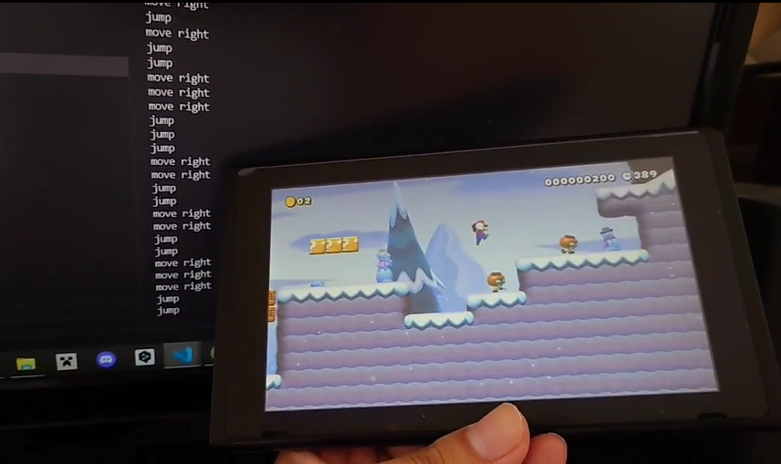

# DQN-mario

 
  

## 概要
ニンテンドースイッチのゲームをAIで自動操作するための試みとして、DQNと呼ばれる深層強化学習を用いて、ニンテンドースイッチのゲームであるスーパーマリオメーカー2の自動プレイを行うコードを実装しました。

## 移動パターン
ダッシュまたはダッシュ+ジャンプの二通りを用意しました。また、マリオが壁に当たった時など、停止したときは、マリオのスタート位置をリセットさせ、エピソードを終了させます。

## 報酬
ひとつ前のエピソードとの移動距離の差のみで定義しました。

## スイッチに情報を転送するために使った技術
スイッチに情報を転送するために、[sys-botbase](https://github.com/olliz0r/sys-botbase)というツールを使用しました。sys-botbaseは、スイッチをPCからリモートコントロールすることができるモジュールです。

## プレイ動画
以下は、訓練の過程で録画したプレイ動画の一部です。1エピソード目と50エピソード目では移動距離に大きな差があることがわかります。

[1エピソード目のプレイ動画](https://youtu.be/eb3pcQYecK4?si=ZcREByohYeGNbej8)

[50エピソード目のプレイ動画](https://youtu.be/rn1ftJWICzc?si=gzBkiydQG2_eYSMK)
